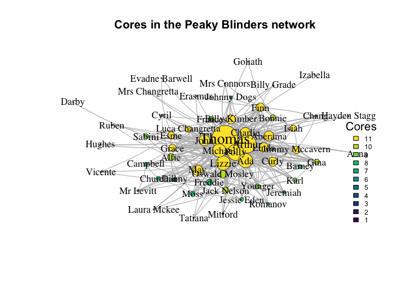
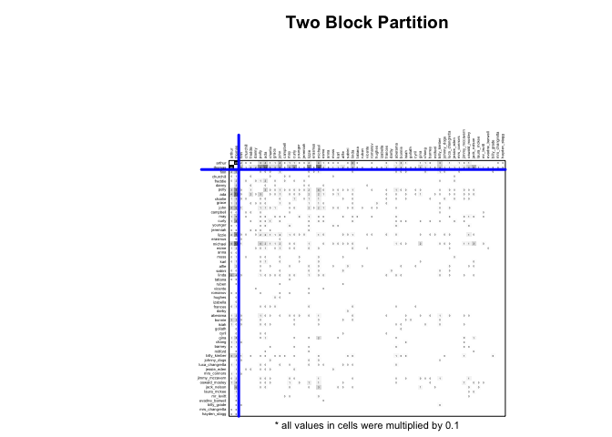

# Peaky Blinders Network Analysis

    library(igraph)
    library(tidyverse)
    library(ggrepel)
    library(blockmodeling)

First, let’s load the adjacency matrix of character interactions created
previously.

    peaky_df <- readRDS("cooccurrence_df.rds")

    peaky_adj_mat <- as.matrix(peaky_df)
    # no self-links
    diag(peaky_adj_mat) <- 0

Now, we can create the network from the adjacency matrix:

    peaky_network <- graph_from_adjacency_matrix(peaky_adj_mat,
                                                mode = "undirected",
                                                weighted = TRUE) 
    peaky_network <- set_vertex_attr(
      peaky_network, 
      "name_edited", 
      value = str_to_title(str_replace_all(V(peaky_network)$name, "_", " "))
    )

    peaky_network

    ## IGRAPH c06f081 UNW- 57 345 -- 
    ## + attr: name (v/c), name_edited (v/c), weight (e/n)
    ## + edges from c06f081 (vertex names):
    ##  [1] finn  --arthur       finn  --thomas       finn  --polly       
    ##  [4] finn  --ada          finn  --charlie      finn  --john        
    ##  [7] finn  --lizzie       finn  --erasmus      finn  --michael     
    ## [10] finn  --linda        finn  --aberama      finn  --bonnie      
    ## [13] finn  --isiah        finn  --chang        finn  --billy_kimber
    ## [16] finn  --johnny_dogs  finn  --mrs_connors  finn  --billy_grade 
    ## [19] arthur--thomas       arthur--churchill    arthur--freddie     
    ## [22] arthur--polly        arthur--ada          arthur--charlie     
    ## + ... omitted several edges

And we can produce an initial plot!

    set.seed(100)
    layout1 <- layout_with_fr(peaky_network)
    layout2 <- layout_with_kk(peaky_network)
    layout3 <- layout_with_dh(peaky_network)
    layout4 <- layout_with_lgl(peaky_network)

    plot.igraph(peaky_network, 
                edge.color="gray",
                edge.curved=.1,
                edge.width= 1+E(peaky_network)$weight/15, 
                vertex.size = degree(peaky_network)/3, 
                vertex.frame.color="#555555",
                vertex.label = V(peaky_network)$name_edited,
                vertex.color = "#FBD87F",
                vertex.label.color="black",
                vertex.label.cex=1+betweenness(peaky_network, weights = NA)/1000,  
                margin=c(0,0,0,0) , 
                asp=0, 
                layout=layout4,
                main = "Network of Peaky Blinders (Seasons 1-6)")

## Characteristics of the Network and Nodes

### Density and diameter

    paste0("Density: ", edge_density(peaky_network))

    ## [1] "Density: 0.216165413533835"

    paste0("Diameter: ", diameter(peaky_network, weights = NA))

    ## [1] "Diameter: 3"

We can check the shortest paths between nodes to see which characters
have the longest distance:

    geodesics <- shortest.paths(peaky_network, weights = NA)

### Measures of centrality

Let’s create a dataframe reporting centrality measures for the most
central characters.

    centrality_df <- tibble(
      names(V(peaky_network)), 
      degree(peaky_network), 
      strength(peaky_network), 
      closeness(peaky_network, weights = NA, normalized = TRUE),
      betweenness(peaky_network, weights = NA, directed = FALSE, normalized = TRUE),
      eigen_centrality(peaky_network)$vector,
      eigen_centrality(peaky_network, weights = NA)$vector,
      page.rank(peaky_network)$vector,
      page.rank(peaky_network, weights = NA)$vector
      )

    names(centrality_df) <- c(
      "Name", 
      "Degree", 
      "Weighted Degree", 
      "Closeness \n(normalised)",
      "Betweenness \n(normalised)", 
      "Eigenvector", 
      "Eigenvector (unweighted)", 
      "Google PageRank",
      "Google PageRank (unweighted)")

    centrality_df_ranked <- centrality_df |> 
      mutate(degree_rank = rank(as.numeric(Degree)),
             w_degree_rank = rank(as.numeric(`Weighted Degree`)),
             eigen_rank = rank(as.numeric(Eigenvector)),
             w_eigen_rank = rank(as.numeric(`Eigenvector (unweighted)`))) |> 
      # check for differences when going to degree to eigenvector
      mutate(diff = eigen_rank - degree_rank,
             w_diff = w_eigen_rank - w_degree_rank)

    toselect <- c(
      "thomas", "polly", "ada", 
      "michael", "arthur",
      "grace", "finn","john", 
      "sabini", "curly")

    order_names <- c(
      "Thomas", "Polly", "Ada", 
      "Michael", "Arthur",
      "Grace", "Finn", "John", 
      "Sabini", "Curly")

    centrality_subset_df <- centrality_df |> 
      filter(Name %in% toselect) |>
      arrange(match(Name, toselect)) |> 
      select("Name", "Degree", "Weighted Degree", 
             "Closeness \n(normalised)", "Betweenness \n(normalised)", 
             "Eigenvector", "Google PageRank") |>
      pivot_longer(-Name, names_to = "centrality", values_to = "value") |>
      group_by(centrality) |> 
      arrange(desc(value)) |> 
      mutate(order = row_number()) |> 
      mutate(Name = str_to_title(str_replace_all(Name, "_", " ")),
             Name = factor(Name, levels = order_names)) |> 
      ungroup() |> 
      mutate(
        centrality = factor(
          centrality, 
          levels = c("Name", "Degree", "Weighted Degree",
                     "Closeness \n(normalised)", "Betweenness \n(normalised)", 
                     "Eigenvector", "Google PageRank")))

Now let’s follow up with a visualisation

    centrality_subset_df |> 
      ggplot(aes(Name, value, fill = centrality)) + 
      geom_bar(stat ="identity") +  
      facet_grid(~ centrality, scales = "free", shrink = TRUE) +
      coord_flip() + 
      geom_label(aes(label = order), size = 4) +
      scale_x_discrete(limits = rev(levels(centrality_subset_df$Name))) +
      theme_minimal()+
      theme(plot.title = element_blank(),
            axis.title.x = element_blank(),
            axis.text.x = element_text(size = 10),
            strip.text = element_text(size = 11, face = "bold"),
            axis.title.y = element_blank(), 
            axis.text.y = element_text(size = 11),
            panel.spacing.x = unit(6, "mm"),
            legend.position = "none")

### Overall centralisation of the network

    summary(degree(peaky_network))

    ##    Min. 1st Qu.  Median    Mean 3rd Qu.    Max. 
    ##    1.00    3.00   10.00   12.11   16.00   54.00

    paste0("Unwieghted degree variance: ", var(degree(peaky_network)))

    ## [1] "Unwieghted degree variance: 111.845864661654"

    paste0("Unwieghted degree standard deviation: ", sd(degree(peaky_network)))

    ## [1] "Unwieghted degree standard deviation: 10.5757205268319"

    paste0("Freeman’s general formula for centralization: ", centralization.degree(peaky_network, loops = FALSE)$centralization)

    ## [1] "Freeman’s general formula for centralization: 0.775324675324675"

## Characteristics of groups of nodes

### Cliques

First, we can identify the largest cliques in the network:

    large_cl <- largest_cliques(peaky_network)
    large_cl

    ## [[1]]
    ## + 11/57 vertices, named, from c06f081:
    ##  [1] michael arthur  ada     polly   thomas  linda   john    lizzie  grace  
    ## [10] esme    may    
    ## 
    ## [[2]]
    ## + 11/57 vertices, named, from c06f081:
    ##  [1] michael         arthur          ada             polly          
    ##  [5] thomas          linda           john            lizzie         
    ##  [9] esme            luca_changretta may            
    ## 
    ## [[3]]
    ## + 11/57 vertices, named, from c06f081:
    ##  [1] michael arthur  ada     polly   thomas  linda   john    lizzie  aberama
    ## [10] charlie finn   
    ## 
    ## [[4]]
    ## + 11/57 vertices, named, from c06f081:
    ##  [1] michael arthur  ada     polly   thomas  linda   john    lizzie  aberama
    ## [10] charlie curly  
    ## 
    ## [[5]]
    ## + 11/57 vertices, named, from c06f081:
    ##  [1] michael         arthur          ada             polly          
    ##  [5] thomas          linda           john            lizzie         
    ##  [9] aberama         may             luca_changretta

    V(peaky_network)$cliques11 <- ifelse(V(peaky_network) %in% unlist(cliques(peaky_network, min = 11, max = 100)), 2, 1)

    plot.igraph(peaky_network, 
                edge.color="gray",
                edge.curved=.1,
                edge.width= 1+E(peaky_network)$weight/15, 
                vertex.size = degree(peaky_network)/3,  
                vertex.frame.color="#555555",
                vertex.label = V(peaky_network)$name_edited,
                vertex.label.color="black",
                vertex.label.cex=1+betweenness(peaky_network, weights = NA)/1000, 
                vertex.color = V(peaky_network)$cliques11,
                margin=c(0,0,0,0) , 
                asp=0, 
                layout=layout4,
                main = "Members of cliques of Size 11 in the Network of Peaky Blinders")

### K-cores

First, we can examine coreness on the network level:

    coreness <- coreness(peaky_network)
    table(coreness)

    ## coreness
    ##  1  2  3  4  5  6  7  8  9 10 11 
    ##  2  5  8  1  3  2  3  5  4  5 19

Let’s visualise at the individual level

    plot.igraph(peaky_network, 
                edge.color="gray",
                edge.curved=.1,
                edge.width= 1+E(peaky_network)$weight/15, 
                vertex.size = degree(peaky_network)/3,  
                vertex.frame.color="#555555",
                vertex.label = V(peaky_network)$name_edited,
                vertex.label.color="black",
                vertex.label.cex=1+betweenness(peaky_network, weights = NA)/1000, 
                vertex.color = hcl.colors(11, palette = "viridis")[as.factor(coreness(peaky_network))],
                margin=c(0,0,0,0) , 
                asp=0, 
                layout=layout4,
                main = "Cores in the Peaky Blinders network")

    legend(x = 0.9,
           y = 0.3,
           bty = "n",
           legend = unique(as.factor(sort(coreness(peaky_network), decreasing = T))),
           cex = 0.7,
           fill = hcl.colors(11, palette = "viridis")[unique(as.factor(sort(coreness(peaky_network), decreasing = T)))],
           title = "Cores",
           title.cex = 1.2
    )

### Blockmodelling & structural equivalence

We will try block-models with 2, 3, 4, 5 and 6 blocks. The approach
chosen is a sum of squares homogeneity block-modelling, and only
“complete” blocks – composed of all 1’s as much as possible – are
allowed.

    c2 <- optRandomParC(M=peaky_adj_mat, k=2, rep=10, approach="ss", blocks="com")
    c3 <- optRandomParC(M=peaky_adj_mat, k=3, rep=10, approach="ss", blocks="com")
    c4 <- optRandomParC(M=peaky_adj_mat, k=4, rep=10, approach="ss", blocks="com")
    c5 <- optRandomParC(M=peaky_adj_mat, k=5, rep=10, approach="ss", blocks="com")
    c6 <- optRandomParC(M=peaky_adj_mat, k=6, rep=10, approach="ss", blocks="com")

I can now plot the adjacency matrix with those three results of
blockmodelling.

    plot(c2, main="Two Block Partition")

    plot(c3, main="Three Block Partition")

    plot(c4, main="Four Block Partition") 

    plot(c5, main="Five Block Partition") 

    plot(c6, main="Six Block Partition") 

To facilitate understanding, it is possible to plot the network with
colours depending on the different blocks.

    plot.igraph(peaky_network, 
                edge.color="gray",
                edge.curved=.1,
                edge.width= 1+E(peaky_network)$weight/15, 
                vertex.size = degree(peaky_network)/3,  
                vertex.frame.color="#555555",
                vertex.label = V(peaky_network)$name_edited,
                vertex.label.color="black",
                vertex.label.cex=1+betweenness(peaky_network, weights = NA)/1500, 
                vertex.color = c3$best$best1$clu,
                margin=c(0,0,0,0) , 
                asp=0, 
                layout=layout4,
               main = "Three block partition")

    plot.igraph(peaky_network, 
                edge.color="gray",
                edge.curved=.1,
                edge.width= 1+E(peaky_network)$weight/15, 
                vertex.size = degree(peaky_network)/3,  
                vertex.frame.color="#555555",
                vertex.label = V(peaky_network)$name_edited,
                vertex.label.color="black",
                vertex.label.cex=1+betweenness(peaky_network, weights = NA)/1500, 
                vertex.color = c4$best$best1$clu,
                margin=c(0,0,0,0) , 
                asp=0, 
                layout=layout4,
               main = "Four block partition")

    plot.igraph(peaky_network, 
                edge.color="gray",
                edge.curved=.1,
                edge.width= 1+E(peaky_network)$weight/15, 
                vertex.size = degree(peaky_network)/3,  
                vertex.frame.color="#555555",
                vertex.label = V(peaky_network)$name_edited,
                vertex.label.color="black",
                vertex.label.cex=1+betweenness(peaky_network, weights = NA)/1500, 
                vertex.color = c5$best$best1$clu,
                margin=c(0,0,0,0) , 
                asp=0, 
                layout=layout4,
               main = "Five block partition")

## Characteristics of the edges

### Global clustering coefficient

    transitivity(peaky_network, type="global")

    ## [1] 0.464455

### Local clustering coefficient

    cbind(V(peaky_network)$name, round(transitivity(peaky_network, type = "local"), digits = 2))

    ##       [,1]              [,2]  
    ##  [1,] "finn"            "0.54"
    ##  [2,] "arthur"          "0.32"
    ##  [3,] "thomas"          "0.2" 
    ##  [4,] "churchill"       "0.58"
    ##  [5,] "freddie"         "0.59"
    ##  [6,] "danny"           "0.64"
    ##  [7,] "polly"           "0.41"
    ##  [8,] "ada"             "0.45"
    ##  [9,] "charlie"         "0.54"
    ## [10,] "grace"           "0.67"
    ## [11,] "john"            "0.5" 
    ## [12,] "campbell"        "0.68"
    ## [13,] "may"             "0.51"
    ## [14,] "curly"           "0.64"
    ## [15,] "younger"         "0.8" 
    ## [16,] "jeremiah"        "0.76"
    ## [17,] "lizzie"          "0.4" 
    ## [18,] "erasmus"         "1"   
    ## [19,] "michael"         "0.51"
    ## [20,] "esme"            "0.66"
    ## [21,] "anna"            "1"   
    ## [22,] "moss"            "0.62"
    ## [23,] "karl"            "0.81"
    ## [24,] "alfie"           "0.49"
    ## [25,] "sabini"          "0.69"
    ## [26,] "linda"           "0.69"
    ## [27,] "tatiana"         "1"   
    ## [28,] "ruben"           "0.67"
    ## [29,] "vicente"         "1"   
    ## [30,] "romanov"         "1"   
    ## [31,] "hughes"          "1"   
    ## [32,] "izabella"        "NaN" 
    ## [33,] "frances"         "0.82"
    ## [34,] "darby"           "NaN" 
    ## [35,] "aberama"         "0.66"
    ## [36,] "bonnie"          "0.69"
    ## [37,] "isiah"           "0.81"
    ## [38,] "goliath"         "1"   
    ## [39,] "cyril"           "0.8" 
    ## [40,] "gina"            "0.84"
    ## [41,] "chang"           "0.9" 
    ## [42,] "barney"          "0.93"
    ## [43,] "mitford"         "1"   
    ## [44,] "billy_kimber"    "0.56"
    ## [45,] "johnny_dogs"     "0.87"
    ## [46,] "luca_changretta" "0.85"
    ## [47,] "jessie_eden"     "0.75"
    ## [48,] "mrs_connors"     "1"   
    ## [49,] "jimmy_mccavern"  "0.7" 
    ## [50,] "oswald_mosley"   "0.62"
    ## [51,] "jack_nelson"     "0.62"
    ## [52,] "laura_mckee"     "1"   
    ## [53,] "mr_levitt"       "0.8" 
    ## [54,] "evadne_barwell"  "1"   
    ## [55,] "billy_grade"     "1"   
    ## [56,] "mrs_changretta"  "1"   
    ## [57,] "hayden_stagg"    "1"

We can visualise the negative correlation between local clustering and
betweenness:

    transitivity_peaky <- transitivity(peaky_network, type="local")
    betweenness_peaky <- betweenness(peaky_network, weights = NA, normalized = TRUE)
    colour_c5 <- factor(c5$best$best1$clu)

    df <- data.frame(LocalClustering = transitivity_peaky, 
                     Betweenness = betweenness_peaky, 
                     Colour = colour_c5) |> 
      mutate(Betweenness_logged = if_else(Betweenness == 0, NA, log(Betweenness)))

    cor_value <- round(cor(df$LocalClustering, df$Betweenness_logged, use = "complete.obs"), 2)

    ggplot(df, aes(x = LocalClustering, y = Betweenness_logged)) +
      geom_point(aes(colour = Colour), size = 3) +
      geom_smooth(method = "lm", color = "blue", size = 0.5) +
      labs(x = "Local Clustering", y = "Betweenness (logged)") +
      annotate("text", x=0.6, y=-0.7, label = paste("Correlation:", cor_value), size = 6, colour = "#A9A9A9") +
      ggrepel::geom_text_repel(aes(label = V(peaky_network)$name_edited), size = 4) +
      theme_minimal()+
      theme(
        legend.position = "none",
        panel.grid = element_blank(),
        axis.title = element_text(size = 12)
      )

    ## `geom_smooth()` using formula = 'y ~ x'

